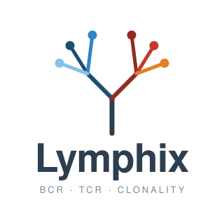
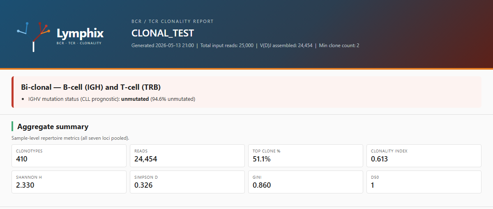
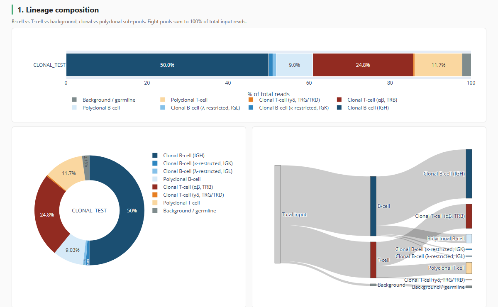

<p align="center"></p>

<p align="center">
BCR / TCR clonality and V(D)J rearrangement calling from 2×150 bp Illumina
DNA capture NGS. Plain, TWIST UMI, and IDT xGen UMI-UDI libraries.
Local Docker, HPC Singularity, or DNAnexus.
</p>

<p align="center">
<a href="LICENSE"></a>
</p>

---

## Quickstart

```bash
pip install .                                              # installs the `lymphix` command

lymphix test                                               # smoke test, no Docker
lymphix --samplesheet samples.csv --outdir results/        # local run
lymphix dnanexus --samplesheet dx://project:/samples.csv   # DNAnexus
```

Without installing, `./lymphix.sh` takes the same arguments.

## Install

- Lymphix itself — `pip install .` from a clone, or `pipx install .` to keep it
  isolated. Provides the `lymphix` command. Python ≥ 3.9.
- Nextflow ≥ 23.10 — `curl -fsSL https://get.nextflow.io | bash`
- Docker Desktop *or* Singularity
- Python dependencies (pandas, numpy, plotly, jinja2) are pulled in automatically
  by `pip install .`; add `pip install .[test]` for pytest

DNAnexus: [`docs/DNANEXUS.md`](docs/DNANEXUS.md).

## Sample sheet

A CSV with one row per sample. Pick the template matching your data, copy
it, replace the file names with your own.

| Your data | Template |
|---|---|
| Paired FASTQ, plain (no UMI) | [FASTQ template](assets/samplesheet_fastq.csv) |
| Paired FASTQ + UMIs (TWIST / xGen) | [UMI template](assets/samplesheet_umi.csv) |
| Pre-aligned BAMs | [BAM template](assets/samplesheet_bam.csv) |
| Validation run with controls | [Controls template](assets/samplesheet_controls.csv) |

```csv
sample_id,fastq_1,fastq_2
PT001,PT001_R1.fastq.gz,PT001_R2.fastq.gz
PT002,PT002_R1.fastq.gz,PT002_R2.fastq.gz
```

#### Columns

| Column | When | Values |
|---|---|---|
| `sample_id` | always | short label, no spaces |
| `fastq_1`,`fastq_2` | FASTQ input | paths (`.gz` OK) |
| `bam` | BAM input | path (sorted + indexed) |
| `umi_preset` | UMI library | `twist`, `xgen_duplex`, `xgen_simplex`, `custom` |
| `expected_status` | controls only | `clonal`, `polyclonal`, `negative` |

Each row uses **FASTQ or BAM, not both**. UMI presets require FASTQ.

## What it does

1. **Trim & QC** — fastp.
2. **UMI consensus** (when `umi_preset != none`) — fgbio: `FastqToBam` →
   `bwa mem` → `GroupReadsByUmi` → consensus calling (duplex for xGen) →
   `FilterConsensusReads`.
3. **V(D)J assembly** — TRUST4. Recovers clonotypes for IGH, IGK, IGL,
   TRA, TRB, TRG, TRD.
4. **Re-annotation** — IgBLAST. Adds V-identity %, productivity, in-frame
   flags.
5. **Clonality metrics** — per locus and aggregate: Shannon H, normalised
   H, Simpson D, Gini, D50, top-clone fraction, **clonality index**
   (1 − H/log N).
6. **Composition call** — eight read pools summing to 100% of total input:
   - Clonal B-cell (IGH-, κ-, λ-restricted)
   - Polyclonal B-cell
   - Clonal T-cell (αβ TRB, γδ TRG/TRD)
   - Polyclonal T-cell
   - Background / germline
7. **κ:λ ratio** — light-chain restriction flag (clinical range 0.5–2.5).
8. **IGHV mutation status** — CLL prognostic call (≥ 98% V-identity = unmutated).
9. **HTML report** per sample — Plotly + Jinja2, self-contained.
10. **Cohort QC** — per-sample pass/fail vs `expected_status` written to
    `pipeline_info/qc_assertions.tsv`.

## UMI presets

| Preset | Read structure (fgbio) | Consensus | Typical use |
|---|---|---|---|
| `none`         | — | none | Plain Illumina, or pre-deduplicated BAMs |
| `twist`        | `5M2S+T 5M2S+T` | molecular | TWIST UMI Adapter System |
| `xgen_duplex`  | `9M+T 9M+T`     | duplex | IDT xGen UMI-UDI (MRD-grade) |
| `xgen_simplex` | `9M+T 9M+T`     | molecular | xGen UMI without duplex calling |
| `custom`       | `--umi_read_structure ...` | molecular | Other chemistries |

UMI samples require `--bwa_index <dir>` (a BWA-indexed reference).

## Outputs

```
results/
├── <sample>/
│   ├── fastp/                 trimmed reads + JSON + HTML
│   ├── umi_consensus/         (UMI runs only) consensus FASTQ + family-size histogram
│   ├── trust4/                TRUST4 raw outputs incl. AIRR
│   ├── igblast/               AIRR table with V-identity %, productivity
│   ├── clonality/
│   │   ├── <sample>.metrics.json
│   │   ├── <sample>.clonotypes.tsv
│   │   └── <sample>.top_clones.tsv
│   └── <sample>.report.html
└── pipeline_info/
    ├── execution_report.html
    ├── software_versions.yml
    └── qc_assertions.tsv
```

## Example results

<p align="center">
  
</p>

<p align="center">
  
</p>

Full HTML reports and `metrics.json` in [`examples/`](examples/).
Regenerate with `make test-smoke`.

## Build the containers

```bash
make build                                       # build all 5 images locally
make push                                        # push to ghcr.io/trethewey/lymphix
make push REGISTRY=ghcr.io/myorg/lymphix         # override registry if needed
```

## Tests

```bash
make test           # unit + smoke
make test-unit      # pytest math tests
make test-smoke     # mock-AIRR → clonality_metrics → report
```

## Validation cohort

Eleven samples with known biology — nine hematological cell lines plus a
no-signal and a polyclonal control. Expected outcomes are encoded in
[`tests/validation_expected.json`](tests/validation_expected.json) with
Cellosaurus IDs and original references.

| Sample | Cellosaurus | Disease | Expected verdict |
|---|---|---|---|
| JURKAT       | CVCL_0065 | T-ALL                       | clonal (TRA + TRB) |
| MOLT-4       | CVCL_0013 | T-ALL                       | clonal (TRB) |
| KARPAS-299   | CVCL_1324 | ALK+ ALCL                   | clonal (TRB / TRA) |
| NAMALWA      | CVCL_0067 | Burkitt lymphoma            | clonal (IGH) |
| DAUDI        | CVCL_0008 | Burkitt lymphoma            | clonal (IGH, mutated IGHV) |
| RAJI         | CVCL_0511 | Burkitt lymphoma            | clonal (IGH, mutated IGHV) |
| OCI-LY1      | CVCL_1879 | DLBCL                       | clonal (IGH) |
| U-266        | CVCL_0566 | Multiple myeloma            | clonal (IGH) |
| MM.1S        | CVCL_8792 | Multiple myeloma            | clonal (IGH) |
| PBMC_HEALTHY | —         | Healthy donor, 3' scRNA-seq | no_signal (chemistry-correct) |
| POLYCLONAL_SIM | —       | Synthetic polyclonal        | no_clonal |

Run end-to-end (downloads ~25 GB from ENA, ~1 h):

```bash
tests/run_validation_cohort.sh [DATA_DIR]
```

Verdict table, lineage-composition stacked bar, and per-locus
clonality-index heatmap on one self-contained page. Two builds:

| File | Size | Use |
|---|---|---|
| [`examples/cohort_overview.html`](examples/cohort_overview.html)         | 4.9 MB | inline Plotly, offline-safe (firewalled clinical networks) |
| [`examples/cohort_overview_cdn.html`](examples/cohort_overview_cdn.html) |  40 KB | loads Plotly from CDN, needs internet |

**View rendered in your browser** (uses the CDN build):
[htmlpreview.github.io / cohort_overview_cdn.html](https://htmlpreview.github.io/?https://github.com/Trethewey/lymphix/blob/main/examples/cohort_overview_cdn.html)

For a permanent URL on this repo, enable
[GitHub Pages](https://github.com/Trethewey/lymphix/settings/pages)
(source: `main`, folder `/`) — the landing page then lives at
[trethewey.github.io/lymphix/](https://trethewey.github.io/lymphix/).

## Panel BED

`regions/clonality_BCR_TCR.bed` (hg38, `chr` prefix) and
`regions/clonality_BCR_TCR.no_chr.bed` (Ensembl/GIAB-style). On-target QC only.

## Citations

Please cite TRUST4 and IgBLAST when publishing results.

### Primary tools

**TRUST4** — V(D)J assembly from bulk and single-cell sequencing.
> Song L, Cohen D, Ouyang Z, Cao Y, Hu X, Liu XS.
> *TRUST4: immune repertoire reconstruction from bulk and single-cell RNA-seq data.*
> Nature Methods 18, 627–630 (2021).
> [doi:10.1038/s41592-021-01142-2](https://doi.org/10.1038/s41592-021-01142-2)
> · [github.com/liulab-dfci/TRUST4](https://github.com/liulab-dfci/TRUST4)

**IgBLAST** — V/D/J alignment, productivity, somatic-hypermutation (V-identity %).
> Ye J, Ma N, Madden TL, Ostell JM.
> *IgBLAST: an immunoglobulin variable domain sequence analysis tool.*
> Nucleic Acids Research 41(W1), W34–W40 (2013).
> [doi:10.1093/nar/gkt382](https://doi.org/10.1093/nar/gkt382)
> · [ncbi.nlm.nih.gov/igblast](https://www.ncbi.nlm.nih.gov/igblast/)

### Clinical interpretation

**IGHV mutation status** — the 98% V-identity cutoff for mutated vs unmutated
CLL is taken from the original prognostic studies and the iwCLL guidelines.
> Damle RN *et al.* *Ig V gene mutation status and CD38 expression as novel prognostic indicators in chronic lymphocytic leukemia.* Blood 94, 1840–1847 (1999). [doi:10.1182/blood.V94.6.1840](https://doi.org/10.1182/blood.V94.6.1840)
>
> Hamblin TJ *et al.* *Unmutated Ig V(H) genes are associated with a more aggressive form of chronic lymphocytic leukemia.* Blood 94, 1848–1854 (1999). [doi:10.1182/blood.V94.6.1848](https://doi.org/10.1182/blood.V94.6.1848)
>
> Hallek M *et al.* *iwCLL guidelines for diagnosis, indications for treatment, response assessment, and supportive management of CLL.* Blood 131, 2745–2760 (2018). [doi:10.1182/blood-2017-09-806398](https://doi.org/10.1182/blood-2017-09-806398)

**AIRR-C clonotype schema** — clonotype tables follow the Adaptive Immune
Receptor Repertoire Community (AIRR-C) v1.4 Rearrangement schema.
> Vander Heiden JA *et al.* *AIRR Community Standardized Representations for Annotated Immune Repertoires.* Frontiers in Immunology 9, 2206 (2018). [doi:10.3389/fimmu.2018.02206](https://doi.org/10.3389/fimmu.2018.02206)

### Supporting tools

| Tool | Used for | Citation |
|---|---|---|
| **fastp**    | Adapter/quality trimming | Chen et al. *Bioinformatics* 34, i884–i890 (2018). [doi:10.1093/bioinformatics/bty560](https://doi.org/10.1093/bioinformatics/bty560) |
| **fgbio**    | UMI grouping + consensus calling | [github.com/fulcrumgenomics/fgbio](https://github.com/fulcrumgenomics/fgbio) |
| **BWA**      | Alignment for UMI-grouped reads | Li & Durbin. *Bioinformatics* 25, 1754–1760 (2009). [doi:10.1093/bioinformatics/btp324](https://doi.org/10.1093/bioinformatics/btp324) |
| **samtools / htslib** | BAM/SAM handling | Danecek et al. *GigaScience* 10, giab008 (2021). [doi:10.1093/gigascience/giab008](https://doi.org/10.1093/gigascience/giab008) |
| **Nextflow** | Workflow orchestration | Di Tommaso et al. *Nature Biotechnology* 35, 316–319 (2017). [doi:10.1038/nbt.3820](https://doi.org/10.1038/nbt.3820) |
| **Plotly**   | Interactive HTML figures | [plotly.com/python](https://plotly.com/python/) |

See [`CITATION.cff`](CITATION.cff) for the machine-readable form.

## Licence

Copyright © 2026 C.S. Trethewey.

Lymphix is free software under the **GNU Affero General Public License v3.0 or
later** (AGPL-3.0-or-later) — see [`LICENSE`](LICENSE). Commercial use is
permitted. If you modify Lymphix and either distribute it or run it as a
network service, you must release your modified source under the same licence.

Lymphix was previously distributed under the MIT licence. Copies already
obtained under MIT remain usable under those terms; the AGPL applies to this
and all subsequent versions.

Third-party tools keep their own licences: TRUST4 (MIT) · IgBLAST (public
domain) · fastp (MIT) · fgbio (MIT) · BWA (GPL-3) · samtools (MIT) ·
Nextflow (Apache-2.0) · Plotly (MIT).
